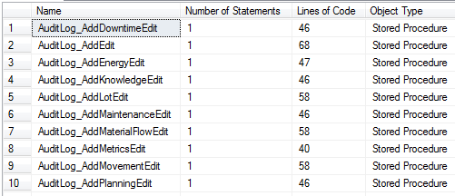
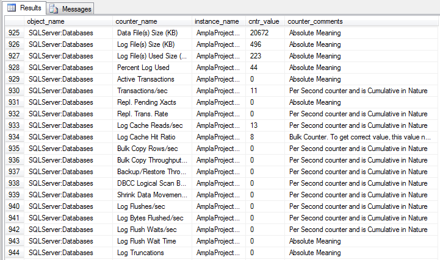

Database Scripts
===

A set of useful database scripts for managing Ampla databases.

----------

###Database.Assembly.Version.sql###

Source: [SQL](Database.Assembly.Version.sql)

Lists the .NET objects in the database and the Assembly Version.
 
Output:

----------

###Database.BackupScript.sql###

Source: [SQL](Database.BackupScript.sql)

Generates a set of backup scripts for Ampla Databases with the date in the file name
 
Output:

----------

###Database.Connections.sql###

Source: [SQL](Database.Connections.sql)

Outputs details about the number and type of connections to the database.

Output:

----------

###Database.FileSizes.sql###

Source: [SQL](Database.FileSizes.sql)

Outputs the size of all the files used databases on the SQL Server.

Output:

----------

###Database.CodeSizes.sql###

Source: [SQL](Database.CodeSizes.sql)

Outputs the list of code (stored procedures and functions) in a database with the number of statements and number of lines.

Output:

----------

###Database.Information.sql###

Source: [SQL](Database.Information.sql)

Outputs information about the Database configuration for all the databases on the SQL server.

Output:

----------

###Database.PerformanceCounters.sql###

Source: [SQL](Database.PerformanceCounters.sql)

Outputs performance counters values into a table with some guidance about how to interpret the results.

Output:  

----------

###Database.RecoveryMode.Simple.sql###

Source: [SQL](Database.RecoveryMode.Simple.sql)

Generates a script for all databases that are set to FULL recovery mode.
In most circumstances, SIMPLE Recovery mode will be sufficient for Ampla databases.

Please check the name of the database before executing the generated script

Output:

----------

###Database.TableSizes.sql###

Source: [SQL](Database.TableSizes.sql)

Outputs the size of all the tables in a database.

Output:

----------

###Database.ShrinkFiles.sql###

Source: [SQL](Database.ShrinkFiles.sql)

Generates SQL to generate DBCC SHRINKFILE statements for all databases on a server.

Output:

----------

###Database.Trustworthy.sql###

Checks to see if the database has .NET assemblies installed and checks the database's TRUSTWORTHY state.

This is used to solve errors that can occur when a database is restored from another server.

See: [../Checks/README.md](../Checks)

Source: [SQL](../Checks/Database.Trustworthy.sql)
